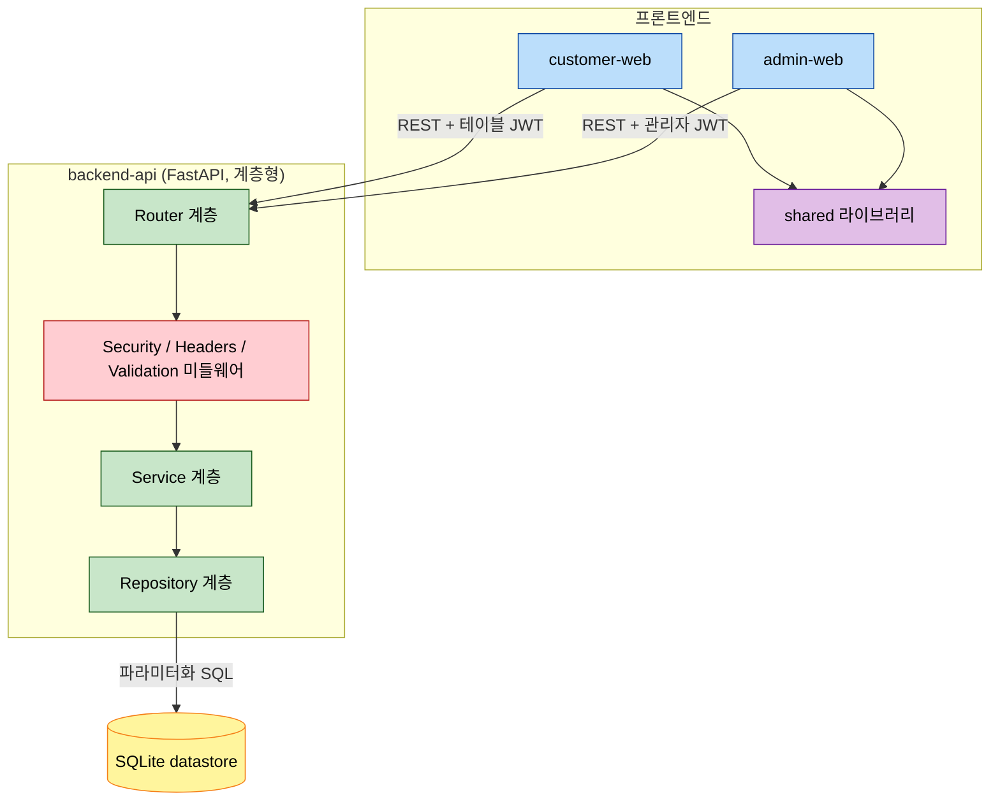

# Component Dependency — 테이블오더 서비스

> 컴포넌트 간 의존성 매트릭스, 통신 패턴, 데이터 흐름. Mermaid 다이어그램과 텍스트 대안을 함께 제공.

---

## 1. 통신 패턴 요약

| From | To | 프로토콜 | 인증 |
|---|---|---|---|
| customer-web | backend-api | REST/HTTP(S), JSON | 테이블 세션 JWT (Q3=A) |
| admin-web | backend-api | REST/HTTP(S), JSON | 관리자 JWT (16시간) |
| customer-web / admin-web | shared | 라이브러리 import | N/A |
| backend-api (Router→Service→Repository) | 내부 호출 | 함수 호출 | 내부 |
| backend-api Repository | datastore(SQLite) | 파라미터화 SQL | 로컬 파일 |

- **폴링(Q4=A)**: customer-web(OrderHistoryView), admin-web(DashboardGrid)가 ~2초 주기로 backend-api 조회.

---

## 2. 시스템 의존성 다이어그램

### Mermaid Diagram



### Text Alternative (always included)

```
프론트엔드
- customer-web  --(REST + 테이블 JWT)-->  backend-api Router
- admin-web     --(REST + 관리자 JWT)-->  backend-api Router
- customer-web  --import-->  shared
- admin-web     --import-->  shared

backend-api (계층형)
- Router 계층      -->  Security/Headers/Validation 미들웨어
- 미들웨어         -->  Service 계층
- Service 계층     -->  Repository 계층
- Repository 계층  --(파라미터화 SQL)-->  SQLite datastore
```

---

## 3. 백엔드 내부 의존성 매트릭스 (Router → Service → Repository)

| Router | Service | Repository |
|---|---|---|
| AuthRouter | AuthService | StoreRepository, TableRepository |
| MenuRouter | MenuService | MenuRepository |
| OrderRouter | OrderService | OrderRepository, TableRepository, MenuRepository |
| TableRouter | TableSessionService, HistoryService | TableRepository, OrderRepository, HistoryRepository |
| HistoryRouter | HistoryService | HistoryRepository |

> 모든 Router는 SecurityMiddleware(SECURITY-08), RequestValidation(SECURITY-05)에 공통 의존.
> 모든 컴포넌트는 LoggingComponent(SECURITY-03), GlobalErrorHandler(SECURITY-15)에 횡단 의존.

---

## 4. 프론트엔드 → 공유 라이브러리 의존성

| 프론트엔드 컴포넌트 | 사용하는 shared 컴포넌트 |
|---|---|
| CartPanel, OrderConfirm | PricingUtil, Types, UiKit |
| OrderHistoryView, DashboardGrid | PollingHook, ApiClient, Types |
| 모든 API 호출 컴포넌트 | ApiClient, Types |
| 모든 화면 | UiKit (터치 버튼 ≥44x44px 등) |

---

## 5. 핵심 데이터 흐름 (주문 생성 → 모니터링)

### Text Flow
```
1. 고객(customer-web/OrderConfirm) → POST /api/orders (테이블 JWT)
2. Router → SecurityMiddleware(검증) → RequestValidation
3. OrderService: 세션 확인 → 단가 조회 → 총액 재검증 → 주문번호 채번 → 저장
4. 응답: 주문번호 반환 → 고객 화면 성공 표시(5초 후 메뉴 리다이렉트)
5. 관리자(admin-web/DashboardGrid): ~2초 폴링 → GET /api/tables/dashboard
6. TableSessionService: 테이블별 총액+최신 3건 집계 → 신규 주문 강조 표시
7. 관리자 상태 변경 → PATCH /api/orders/{id}/status → 다음 폴링 시 고객 화면(C5-S2) 반영
```

---

## 6. 결합도 및 순환 의존 점검

- **계층 단방향**: Router → Service → Repository → DB (역방향 의존 없음).
- **순환 의존 없음**: TableSessionService ↔ HistoryService는 TableSessionService → HistoryService 단방향(이용 완료 시 호출).
- **프론트엔드 → 백엔드**: 단방향(HTTP 요청), 서버는 폴링 응답만 제공(푸시 없음).
- **shared**: 프론트엔드 앱이 의존하되 shared는 앱에 의존하지 않음(단방향).
