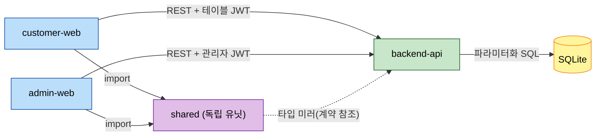

# Unit of Work Dependency — 테이블오더 서비스

> 유닛 간 의존성 매트릭스, 통신 패턴, 구현 순서.

---

## 1. 의존성 매트릭스 (4개 유닛)

| 유닛 (From ↓) | backend-api | shared | customer-web | admin-web |
|---|---|---|---|---|
| **backend-api** | — | 없음 | 없음 | 없음 |
| **shared** | 타입 미러(계약 참조) | — | 없음 | 없음 |
| **customer-web** | REST(테이블 JWT) | import | — | 없음 |
| **admin-web** | REST(관리자 JWT) | import | 없음 | — |

- backend-api: 어떤 유닛에도 의존하지 않음(계약 SSOT 제공자).
- shared: backend-api 계약을 참조해 TS 타입 미러링(런타임 코드 의존 아님). 프론트엔드에 의존하지 않음(단방향 소비).
- customer-web / admin-web: backend-api(REST) + shared(import)에 의존.
- **순환 의존 없음.**

---

## 2. 유닛 의존성 다이어그램

### Mermaid Diagram



### Text Alternative

```
customer-web  --(REST + 테이블 JWT)-->  backend-api
admin-web     --(REST + 관리자 JWT)-->  backend-api
customer-web  --import-->  shared
admin-web     --import-->  shared
shared        ..(타입 미러/계약 참조)..>  backend-api
backend-api   --(파라미터화 SQL)-->  SQLite
```

---

## 3. 통신 패턴

| 경계 | 패턴 | 계약/인증 |
|---|---|---|
| customer-web ↔ backend-api | REST/JSON, ~2초 폴링(전체 조회) | OpenAPI 계약, 테이블 세션 JWT |
| admin-web ↔ backend-api | REST/JSON, ~2초 폴링(대시보드) | OpenAPI 계약, 관리자 JWT(16h) |
| 프론트엔드 → shared | 라이브러리 import | TS 타입은 백엔드 Pydantic 미러(Q5=A) |
| backend-api → SQLite | Repository 통한 파라미터화 SQL | 로컬 파일 |

---

## 4. 구현 순서 및 사유 (4개 유닛)

| 순서 | 유닛 | 사유 | 선행 산출물 |
|---|---|---|---|
| 1 | **backend-api** | 다른 유닛이 의존하는 API 계약·데이터·보안 확정 | OpenAPI 스키마, 시드 데이터 |
| 2 | **shared** | 백엔드 계약 기반 TS 타입·공통 유틸/훅 확정 → 두 프론트엔드 재사용 | ApiClient, Types, UiKit, PricingUtil, PollingHook |
| 3 | **customer-web** | 핵심 고객 플로우, shared 소비 | 확정된 계약 + shared |
| 4 | **admin-web** | shared 재사용, 관리자 기능 구현 | 확정된 계약 + shared |

- **Critical path**: backend-api → shared (이후 두 프론트엔드를 블로킹).
- **병렬화 기회**: shared 확정 후 customer-web/admin-web은 원칙적으로 병렬 가능하나, 본 워크플로우는 per-unit 순차 진행.
- **통합 체크포인트**: 각 프론트엔드 유닛 완료 시 backend-api와 통합 테스트(Build and Test 단계).

---

## 5. 공유 리소스 및 조정 포인트

- **API 계약(OpenAPI)**: backend-api가 SSOT. 변경 시 shared TS 타입 동기화 필요.
- **도메인 타입**: 백엔드 Pydantic 소유 → shared TS 미러(Q5=A). 필드 추가/변경 시 미러 갱신.
- **인증 토큰 형식**: 테이블 JWT / 관리자 JWT 클레임 구조는 backend-api에서 정의, 프론트엔드가 준수.
