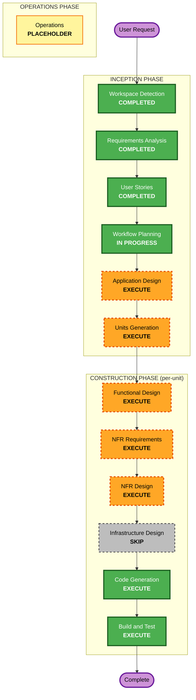

# Execution Plan — 테이블오더 서비스

> 본 실행 계획은 요구사항(`requirements.md`)과 사용자 스토리(`stories.md`, `personas.md`)를 근거로,
> 이후 실행할 단계(Stage)와 생략할 단계를 결정한다.

## Detailed Analysis Summary

### Transformation Scope
- **프로젝트 유형**: Greenfield (신규 개발, 기존 코드 없음)
- **Transformation Type**: N/A (브라운필드 전환 아님)
- **Primary Changes**: 신규 시스템 3개 논리 구성요소 개발 — 고객용 웹앱(React+TS), 관리자용 웹앱(React+TS), 백엔드 API(FastAPI) + SQLite 데이터 저장소

### Change Impact Assessment
- **User-facing changes**: Yes — 고객용/관리자용 두 개의 신규 웹 UI 전체
- **Structural changes**: Yes — 신규 시스템 아키텍처 정의(프론트엔드 2 + 백엔드 + DB)
- **Data model changes**: Yes — Store, Table, Session, Menu, Category, Order, OrderItem, OrderHistory, AdminUser 등 신규 스키마
- **API changes**: Yes — 인증/메뉴/주문/테이블·세션/과거이력 신규 엔드포인트 전체
- **NFR impact**: Yes — 보안(JWT·bcrypt·입력검증·인가·로깅·보안헤더), 성능(폴링 ~2초), 사용성(터치 UI), 데이터(세션 라이프사이클·Asia/Seoul), 테스트(PBT 부분)

### Risk Assessment
- **Risk Level**: Medium — 다중 사용자 유형, 테이블 세션 16시간 라이프사이클, 준실시간 폴링, 보안 베이스라인 전면 적용
- **Rollback Complexity**: Easy — 로컬 개발 환경, 프로덕션 배포 없음
- **Testing Complexity**: Moderate — 단위/통합/속성 기반(금액 계산) 테스트 필요, 세션 종료·총액 재계산 등 상태 전이 검증

## Workflow Visualization

### Mermaid Diagram



### Text Alternative (always included)

```
INCEPTION PHASE
- Workspace Detection ........ COMPLETED
- Reverse Engineering ........ SKIPPED (greenfield)
- Requirements Analysis ...... COMPLETED
- User Stories ............... COMPLETED
- Workflow Planning .......... IN PROGRESS (this stage)
- Application Design ......... EXECUTE
- Units Generation ........... EXECUTE

CONSTRUCTION PHASE (per-unit loop, then Build & Test)
- Functional Design .......... EXECUTE
- NFR Requirements ........... EXECUTE
- NFR Design ................. EXECUTE
- Infrastructure Design ...... SKIP (local dev only, no cloud/IaC)
- Code Generation ............ EXECUTE (always)
- Build and Test ............. EXECUTE (always)

OPERATIONS PHASE
- Operations ................. PLACEHOLDER (future)
```

## Phases to Execute

### INCEPTION PHASE
- [x] Workspace Detection (COMPLETED)
- [x] Reverse Engineering (SKIPPED — greenfield, no existing code)
- [x] Requirements Analysis (COMPLETED)
- [x] User Stories (COMPLETED)
- [x] Execution Plan (IN PROGRESS)
- [ ] Application Design — **EXECUTE**
  - **Rationale**: 신규 구성요소 3종(고객 웹, 관리자 웹, FastAPI 백엔드)과 서비스 계층·컴포넌트 메서드·비즈니스 규칙(세션 라이프사이클, 총액 재계산, 인가 경계) 정의가 필요.
- [ ] Units Generation — **EXECUTE**
  - **Rationale**: 시스템을 여러 작업 단위(백엔드 API/데이터, 고객 프론트엔드, 관리자 프론트엔드)로 분해해야 하며, 다수 모듈·API·상태 관리가 존재.

### CONSTRUCTION PHASE (각 유닛별 per-unit 루프)
- [ ] Functional Design — **EXECUTE**
  - **Rationale**: 신규 데이터 모델/스키마와 복잡한 비즈니스 로직(세션 종료 시 이력 이동·리셋, 서버측 총액 재검증, 주문 상태 전이)의 상세 설계 필요.
- [ ] NFR Requirements — **EXECUTE**
  - **Rationale**: Security Baseline 활성화(블로킹 제약), 성능(폴링 ~2초), 사용성, 데이터/타임존 등 NFR이 명확히 존재. 기술 스택은 확정되었으나 NFR 상세 정의 필요.
- [ ] NFR Design — **EXECUTE**
  - **Rationale**: NFR Requirements 실행에 따라 JWT 검증·bcrypt·입력검증·객체수준 인가·구조화 로깅·보안헤더 등 보안 패턴과 폴링 성능 설계를 반영해야 함.
- [ ] Infrastructure Design — **SKIP**
  - **Rationale**: 배포 대상이 로컬 개발 환경(Q12)이며 클라우드 리소스/IaC(CDK 등)가 없음. 로컬 실행 토폴로지(프론트엔드 2 + 백엔드 + SQLite)와 구동 방법은 Build and Test 단계의 실행 지침에서 다룸. *(프로덕션 배포 검토 시 재활성화 권장)*
- [ ] Code Generation — **EXECUTE (ALWAYS)**
  - **Rationale**: 각 유닛의 구현 계획 수립 및 코드·테스트 생성 필요.
- [ ] Build and Test — **EXECUTE (ALWAYS)**
  - **Rationale**: 전체 유닛 빌드, 단위/통합/속성기반(금액) 테스트, 로컬 구동·검증 지침 필요.

### OPERATIONS PHASE
- [ ] Operations — **PLACEHOLDER**
  - **Rationale**: 향후 배포·모니터링 워크플로우 확장 영역.

## Proposed Units (Units Generation 단계에서 확정)
잠정 유닛 분해(제안) — 정식 분해는 Units Generation에서 확정:
1. **backend-api** — FastAPI 앱, 인증(JWT/bcrypt), 메뉴/주문/테이블·세션/이력 API, SQLite 데이터 모델·시드, 보안 베이스라인
2. **customer-web** — 고객용 React+TS 웹앱(자동 로그인, 메뉴/장바구니/주문/내역, 폴링)
3. **admin-web** — 관리자용 React+TS 웹앱(로그인, 그리드 대시보드/폴링, 상태변경, 테이블·세션 관리, 과거 내역)

## Estimated Timeline
- **Total Stages to Execute (INCEPTION 남은 단계 + CONSTRUCTION)**: 2 (INCEPTION) + per-unit 4~5 stages × 유닛 수 + Build and Test
- **Estimated Duration**: 중간 규모 — 유닛 수(잠정 3) 기준 다수 세션에 걸친 진행 예상

## Success Criteria
- **Primary Goal**: 로컬에서 구동 가능한 MVP 테이블오더 시스템(고객 웹 + 관리자 웹 + FastAPI/SQLite) 완성
- **Key Deliverables**:
  - 자동 로그인 + 16시간 테이블 세션 라이프사이클
  - 메뉴 조회·장바구니·주문 생성·현재 세션 주문 내역(고객)
  - 폴링 기반 준실시간 대시보드·상태 변경·테이블/세션 관리·과거 내역(관리자)
  - Security Baseline 준수(JWT·bcrypt·입력검증·인가·로깅·보안헤더)
- **Quality Gates**:
  - Must(MVP) 스토리 인수 조건(Given/When/Then) 충족
  - 금액 계산 등 순수 로직에 대한 속성 기반 테스트 통과
  - 활성 보안 베이스라인 규칙 비위반(블로킹 findings 0)
